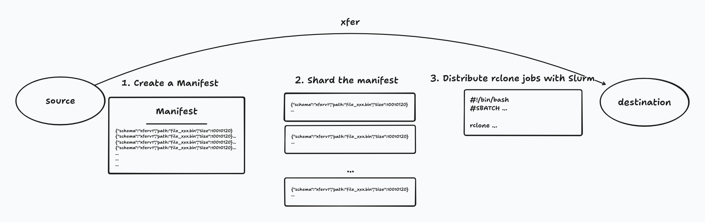

# xfer
Scalable S3↔S3 Transfers with rclone, Slurm, and pyxis



`xfer` is a command-line tool for orchestrating **large-scale S3 data transfers** on HPC and cloud clusters using:

* **rclone** (inside a container)
* **Slurm job arrays**
* **enroot + pyxis**
* **manifest-based sharding** for reliability and resumability

It is designed for datasets with:

* Millions of objects
* Highly variable object sizes
* Long-running transfers that need retries, logging, and restartability

---

## Key features

* 📄 **Stable JSONL manifest** (`xfer.manifest.v1`)
* 🧩 **Byte-balanced sharding** to avoid long-tail array tasks
* 🔁 **Automatic retries with Slurm requeue**
* ⏭ **Skip-if-done semantics** per shard
* 📦 **Containerized rclone** (no host rclone dependency)
* ⚙️ **Configurable topology** (array size, concurrency, CPU/mem)
* 🧪 Safe to re-run: idempotent by design

---

## Requirements

### Cluster / runtime

* Slurm
* enroot + pyxis enabled (`srun --container-image` works)
* Network access from compute nodes to both S3 endpoints

### Local tools

* Python ≥ 3.10
* [`uv`](https://github.com/astral-sh/uv)
* An rclone config file (`rclone.conf`) with your S3 remotes

---

## Installation (with uv)

Clone the repository:

```bash
git clone https://github.com/fluidnumerics/xfer.git ~/xfer
cd ~/xfer
```

Create and sync the virtual environment:

```bash
uv venv
uv sync
```

Run the CLI (no install required):

```bash
uv run xfer --help
```

Optional: install editable for convenience

```bash
uv pip install -e .
xfer --help
```

---

## rclone configuration

You must have an rclone config on the **submit host**, e.g.:

```ini
[s3src]
type = s3
provider = Other
endpoint = https://objects.source.example.com
access_key_id = ...
secret_access_key = ...

[s3dst]
type = s3
provider = Other
endpoint = https://objects.dest.example.com
access_key_id = ...
secret_access_key = ...
```

This file is mounted read-only into the container at runtime.

---

## Quick start (one-shot pipeline)

This builds the manifest, shards it, renders Slurm scripts, **and submits the job**:

```bash
uv run xfer run \
  --run-dir run_001 \
  --source s3src:mybucket/dataset \
  --dest   s3dst:mybucket/dataset \
  --num-shards 512 \
  --array-concurrency 96 \
  --rclone-image rclone/rclone:latest \
  --rclone-config ~/.config/rclone/rclone.conf \
  --rclone-flags "--transfers 48 --checkers 96 --fast-list --stats 30s" \
  --partition transfer \
  --cpus-per-task 4 \
  --mem 8G \
  --submit
```

This will submit a Slurm array job immediately.

---

## Step-by-step workflow (recommended for first use)

### 1. Build a manifest

Lists all objects using `rclone lsjson` (inside a container) and writes a stable JSONL manifest.

```bash
uv run xfer manifest build \
  --source s3src:mybucket/dataset \
  --dest   s3dst:mybucket/dataset \
  --out run/manifest.jsonl \
  --rclone-image rclone/rclone:latest \
  --rclone-config ~/.config/rclone/rclone.conf \
  --extra-lsjson-flags "--fast-list"
```

Output:

```
run/
  manifest.jsonl
```

---

### 2. Shard the manifest

Splits the manifest into balanced shards (by total bytes):

```bash
uv run xfer manifest shard \
  --in run/manifest.jsonl \
  --outdir run/shards \
  --num-shards 512
```

Output:

```
run/
  shards/
    shard_000000.jsonl
    shard_000001.jsonl
    ...
    shards.meta.json
```

---

### 3. Render Slurm scripts

Creates:

* `worker.sh` — executed by each array task
* `sbatch_array.sh` — Slurm submission script
* `submit.sh` — convenience wrapper
* `config.resolved.json` — frozen run configuration

```bash
uv run xfer slurm render \
  --run-dir run \
  --num-shards 512 \
  --array-concurrency 96 \
  --job-name s3-xfer \
  --time-limit 24:00:00 \
  --partition transfer \
  --cpus-per-task 4 \
  --mem 8G \
  --rclone-image rclone/rclone:latest \
  --rclone-config ~/.config/rclone/rclone.conf
```

---

### 4. Submit the job

```bash
uv run xfer slurm submit --run-dir run
```

---

## Monitoring progress

### Slurm

```bash
squeue -j <jobid>
sacct -j <jobid> --format=JobID,State,Elapsed
```

#### Adjusting the array throttle

If you're seeing connection refused errors or a high number of retries for copying, you can back off on the number of simultaneous array tasks by lowering the `ArrayTaskThrottle`

```bash
scontrol update ArrayTaskThrottle=<new array concurrency> JobId=<jobid>
```

### Logs

```
run/
  logs/
    shard_12_attempt_1.log
    shard_12_attempt_2.log
```

### State markers

```
run/
  state/
    shard_12.done
    shard_47.fail
```

* `.done` → shard completed successfully
* `.fail` → last attempt failed
* `.attempt` → retry counter

---

## Retry & resume behavior

* Failed shards are **automatically requeued** up to `MAX_ATTEMPTS`
* Completed shards are skipped on re-run
* You can safely re-submit the same array job

To re-submit manually:

```bash
sbatch run/sbatch_array.sh
```

---

## Recommended rclone flags (starting points)

### High-throughput S3↔S3

```text
--transfers 32
--checkers 64
--fast-list
--retries 10
--low-level-retries 20
--stats 30s
```

### Small objects (metadata heavy)

```text
--transfers 16
--checkers 128
--fast-list
```

### Track progress

```text
--progress --stats 600s
```

---

## Directory structure (reference)

```
run/
  manifest.jsonl
  shards/
    shard_000123.jsonl
    shards.meta.json
  logs/
  state/
  worker.sh
  sbatch_array.sh
  submit.sh
  config.resolved.json
```

---

## Design notes

* **Manifest is immutable** → enables reproducibility and auditing
* **Shards are deterministic** → re-runs don’t reshuffle work
* **rclone handles object-level idempotency**
* **Slurm handles node-level failures**
* **xfer handles orchestration only**


## Contributing
* To enable pre-commit `black` formatting, run `uv run pre-commit install`
  * If necessary, you can format locally with `uv run black .`
* Name branches as either:
  * `<your name>/<branch name>` (e.g., `alice/update-readme`)
  * `<type of contribution>/<branch name>` (e.g., `feature/claude-integration`) (these are usually `feature`, `patch`, or `docs`)
* Do NOT squash PRs into a single commit
